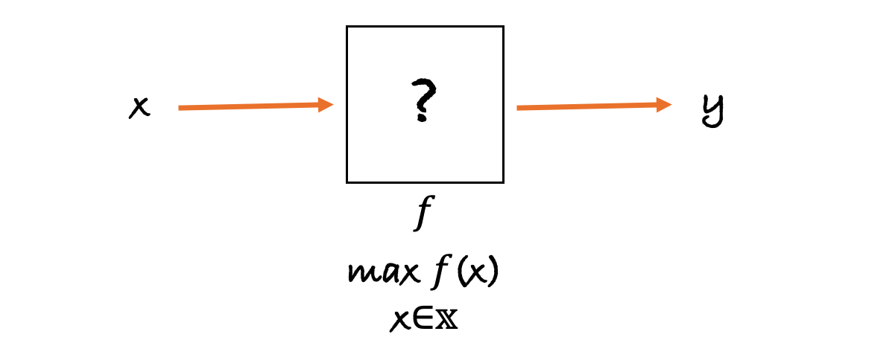
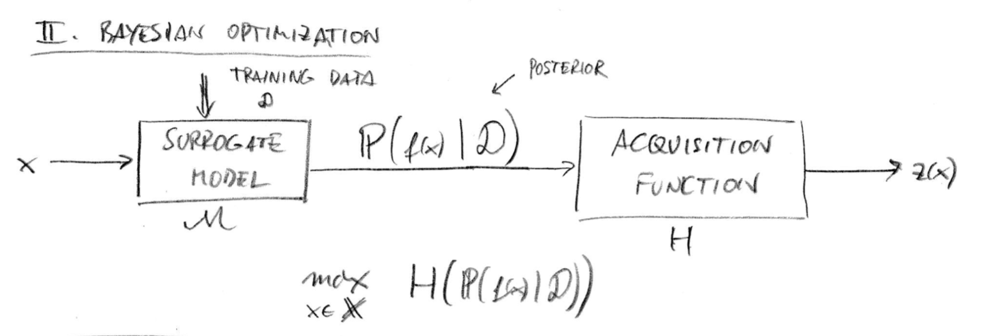
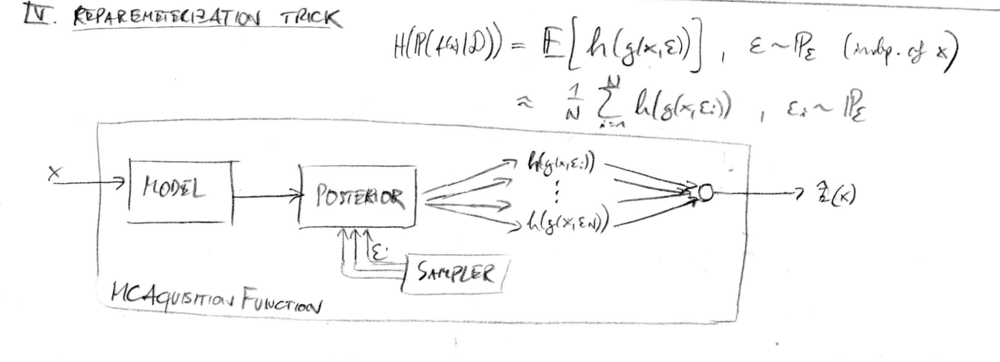

For a high-level view of what botorch tries to be, see our
[design philosophy](design_philosophy).

## Black-Box Optimization

At a high level, the problem underlying Bayesian optimization (BO) is to maximize
some expensive-to-evaluate black box function $f$. In other words, we do not have
access to the functional form of $f$ and our only recourse is to evaluate $f$ at
a sequence of test points, with the hope of determining a near-optimal value after
a small number of evaluations. BO is a general approach to adaptively select these
test points (or batches of test points to be evaluated in parallel) that allows
for a principled trade-off between evaluating $f$ at regions of high uncertainty
and regions of good performance.

## Bayesian Optimization

#### Models

In order to optimize $f$ within a small number of evaluations, we need a way of
extrapolating our belief about what $f$ looks like at points we have not yet
evaluated. In BO, this is referred to as the *surrogate model*. Importantly,
the surrogate model should be able to quantifying the uncertainty of its
predictions in form of a **posterior** distribution over function values $f(x)$
at points $x$.

The surrogate model for $f$ is typically a Gaussian Process (GP), in which case
the posterior distribution on any finite collection of points is a multivariate
normal distribution. A GP is usually specified using a mean function $\mu(x)$
and a covariance kernel $k(x,x')$, from which a mean vector
$(\mu(x_0), \ldots, \mu(x_k))$ and covariance matrix $\Sigma$ with
$\Sigma_{ij} = k(x_i, x_j)$ can be computed for any set of points
$(x_1, \ldots x_k)$. Using a GP surrogate model for $f$ means that we assume
$(f(x_1), \ldots, f(x_k))$ is multivariate normal with a mean vector and covariance
matrix determined by $\mu(x)$ and $k(x,x')$.

While GPs have been a very successful modeling approach, botorch's
first-class support for MC-sampling based acquisition functions makes it
straightforward to also use other model types. In particular, botorch
makes no particular assumptions on what kind of model is being used,
so long as is able to produce a posterior over outputs given an input $x$.
See [Models](models.md#models) for more details on models in botorch.
(**TODO: Expand on this**).

#### Posteriors

Posteriors represent the "belief" a model has about the function values based on
the data it has been trained with. That is, the posterior distribution over the
outputs conditional on the data seen so far (hence the name).

When using a GP model, the posterior is given explicitly as a multivariate
Gaussian (fully parameterized by its mean and covariance matrix). In other cases,
the posterior may be implicit in the model and not easily described by a
small set of parameters.

botorch abstracts away from the particular form of the model posterior by
providing a simple [Posteriors](posteriors.md#posteriors) API.

#### Acquisition Functions

Acquisition functions are heuristics employed to evaluate the usefulness of one
of more design points for achieving the objective of maximizing the underlying
black box function.

Some of these acquisition functions have closed-form solutions under Gaussian
posteriors, but many of them (especially when assessing the joint value of
multiple points in parallel) do not. In the latter case, one can resort to using
Monte-Carlo (MC) sampling in order to approximate the acquisition function.

botorch supports both analytic as well as (quasi-) Monte-Carlo based acquisition
functions. It provides an API for [Acquisition Functions](acquisition.md) that
abstracts away from the particular type, so that optimization can be performed
on the same objects.

## Evaluating Monte-Carlo Acquisition Functions

The idea behind using Monte-Carlo sampling for evaluating acquisition functions
is simple: instead of computing the (intractable) expectation over the posterior,
we sample from the posterior and use the sample average as an approximation.

#### Objectives

To give additional flexibility in the case of MC-based acquisition functions,
botorch gives the option of transforming the output(s) of the model through an
`Objective` module, which returns a one-dimensional output that is passed to the
acquisition function. The `MCAcquisitionFunction` class defaults its objective to
`IdentityMCObjective()`, which simply returns the last dimension of the model output.
Thus, for the standard use case of a single-output GP that directly models the black
box function $f$, no special objective module needs to be defined. For more details
on the advanced features enabled by the `Objective` module, see
[Objectives](objectives.md#objectives).

## The Re-parameterization Trick

The re-parameterization trick (see e.g. [^KingmaWelling2014], [^Rezende2014])
can be used to write the posterior distribution as a deterministic
transformation of an auxiliary random variable $\epsilon$. For example, a
normally distributed random variable $X$ with mean $\mu$ and standard deviation
$\theta$ has the same distribution as $\mu + \sigma \epsilon$ where $\epsilon$
is a standard normal. Therefore, an expectation with respect to $X$ can be
approximated using samples from $\epsilon$. In the case where $\mu$ and $\sigma$
are parameters of an optimization problem, MC approximations of the objective at
different values of $\mu$ and $\sigma$ can be computed using a single set of
"base samples." Importantly, a re-parameterization of this kind allows 
to back-propagate gradients through the samples, which enables auto-
differentiation of MC-based acquisition functions with respect to the
candidate points.

Base samples are constructed using an `MCSampler` object, which provides an
interface that allows for different sampling techniques. `IIDNormalSampler`
utilizes independent standard normal draws, while `SobolQMCNormalSampler` uses
quasi-random, low-discrepancy "Sobol" sequences as uniform samples which are
then transformed to construct normal samples. Sobol sequences are more evenly
distributed than i.i.d. uniform samples and tend to improve the convergence rate
of MC estimates of integrals/expectations. We find that Sobol sequences substantially
improve the performance of MC-based acquisition functions, and so
`SobolQMCNormalSampler` is used by default. For more details, see [Monte-Carlo samplers](samplers.md).

[^KingmaWelling2014]: D. P. Kingma, M. Welling. Auto-Encoding Variational Bayes.
ICLR, 2013.

[^Rezende2014]: D. J. Rezende, S. Mohamed, D. Wierstra. Stochastic
Backpropagation and Approximate Inference in Deep Generative Models. ICML, 2014.
